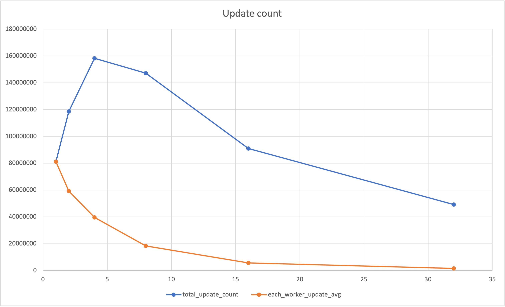

# Project 2: Wait-free Snapshot

- task is to implement wait-free snapshot
- snapshot interface supports
    1. update: each thread update each register value
    2. scan: read all thread's register values atomically
- wait-free means all method finishes in finite steps.

# Implementation

```cpp
// include/Timer.hpp
class Timer {
private:
  double now() {
    struct timeval t;
    gettimeofday(&t, 0);
    return t.tv_sec + t.tv_usec / 1000000.0;
  }
public:
  double s;
  Timer() {
    s = now();
  }

  void restart() {
    s = now();
  }

  double get() {
    return now() - s;
  }
};
```
utility class for checking time. 


get() method will return elapsed time(in sec) after the Timer instance created or restart() called.


(used for checking worker thread's running time)


```cpp
// include/RandomIntGenerator.hpp
class RandomIntGenerator
{
private:
  std::random_device rd;
  std::mt19937 gen;
  std::uniform_int_distribution<int> dis;
public:
  RandomIntGenerator(): gen(rd()), dis(std::uniform_int_distribution<int>(INT32_MIN, INT32_MAX)) {};
  int generate() {
    return dis(gen);
  }
};
```
utility class for generating random integer value.


generate() wil return random integer value.


```cpp
// include/WFSnapshot.hpp :: StampedSnap
template <typename T>
class StampedSnap
{
public:
  long long stamp;
  T value;
  std::vector<T> snap;

  StampedSnap(T value_) {
    stamp = 0;
    value = value_;
  };
  StampedSnap(long long stamp_, T value_, std::vector<T> snap_) {
    stamp = stamp_;
    value = value_;
    snap = snap_;
  };
};
```


```cpp
// include/WFSnapshot.hpp :: WFSnapshot
template <typename T>
class WFSnapshot
{
// private:

public:
  // public for testing
  std::vector<StampedSnap<T> > a_table;

  // public for testing
  std::vector<StampedSnap<T> > collect() {
    auto copy = a_table;
    return copy;
  };

  WFSnapshot(int capacity, T init) {
    a_table.reserve(capacity);
    for (int i = 0; i < capacity; ++i) {
      a_table.push_back(StampedSnap<T>(init));
      a_table[i].snap.resize(capacity);
    }
  };

  std::vector<T> scan() {
    std::vector<StampedSnap<T> > oldCopy;
    std::vector<StampedSnap<T> > newCopy;
    std::vector<bool> moved(a_table.size(), false);
    oldCopy = collect();

    collect: while (true) {
      newCopy = collect();
      for (int j = 0; j < a_table.size(); ++j) {
        if (oldCopy[j].stamp != newCopy[j].stamp) {
          if (moved[j]) {
            return oldCopy[j].snap;
          } else {
            moved[j] = true;
            oldCopy = newCopy;
            goto collect;
          }
        }
      }
      break;
    }

    std::vector<T> result(a_table.size());
    for (int j = 0; j < a_table.size(); ++j) {
      result[j] = newCopy[j].value;
    }
    return result;
  };

  void update(int me, T value) {
    auto snap = scan();
    auto oldValue = a_table[me];
    auto newValue = StampedSnap<T>(oldValue.stamp + 1, value, snap);
    a_table[me] = newValue;
  };
};
```

```cpp
// main.cc
#define UPDATE_TIME 60.0
// ...

void* ThreadFunc(void* arg) {
  long tid = (long)arg;
  long long updateCnt = 0;
  while (true) {
    if (timer.get() >= UPDATE_TIME) break;
    // update thread's register value to random number.
    wfsnapshot->update(tid, randomIntGenerator.generate());
    updateCnt++;
  }
  // return local update count.
  return (void*)updateCnt;
}

//...
int main(int argc, char const *argv[]) {

// ...

  // timer start
  timer.restart();
  // worker thread creation
  for (long i = 0; i < NUM_THREADS; i++) {
    if (pthread_create(&threads[i], 0, ThreadFunc, (void*)i) < 0) {
      cout << "pthread_create error!\n";
      return -1;
    }
  }

  long long total_update_cnt = 0;
  long long ret;
  // collect result
  for (int i = 0; i < NUM_THREADS; i++) {
    pthread_join(threads[i], (void**)&ret);
    cout << "thread_" << i << ": " << ret << '\n';
    total_update_cnt += ret;
  }
  cout << setw(12) << "thread_num" << "\t" << setw(20) << "total_update_count" << '\n';
  cout << setw(12) << NUM_THREADS << "\t" << setw(20) << total_update_cnt << '\n';

}
```
each thread updates it's register value to random value for UPDATE_TIME (60sec).

main thread start timer before creating threads and collect result, print each thread's update count(for analysis) and print total update count made by worker threads.


# Test

```cpp
// test/RandomIntGeneratorTest.cc
TEST(RandomIntGeneratorTest, HandlesUniformDistribution) {

  long long randomCnt = 10000;
  RandomIntGenerator rg;
  long long kind = 0;
  std::unordered_map<int, int> freq;
  for (int i = 0; i < randomCnt; ++i) {
    if (freq[i]++ == 0) {
      ++kind;
    };
  }

  long long eachCnt = randomCnt / kind;
  for (auto [num, cnt]: freq) {
    // to make uniform distribution... cnt is always eachCnt or eachCnt + 1.
    // if randomCnt <= 1 << 32 (number of int32), cnt will be always 1.
    ASSERT_EQ(cnt, 1);
  }
}
```
test generator generates random integer value in uniform distribution.

```cpp
// test/TimerTest.cc
TEST(TimerTest, HandlesTimer) {
  std::vector<double> checkList = {1, 2, 3, 4, 5, 6, 7, 8, 9, 10};

  // check timer can estimate time with 20% error
  for (auto time: checkList) {
    Timer timer;
    struct timeval t;
    
    gettimeofday(&t, 0);
    auto start = t.tv_sec + t.tv_usec / 1000000.0;
    while (true) {
      if (timer.get() >= time) break;
    }
    gettimeofday(&t, 0);
    auto end = t.tv_sec + t.tv_usec / 1000000.0;
    auto elapsed_time = end - start;
    
    ASSERT_GE(elapsed_time, (time) * 0.8);
    ASSERT_LE(elapsed_time, (time) * 1.2);
  }
}
```

test timer can estimate elapsed time with 20% error. (set error percentage 20% for safe. real error percentage is low)

```cpp
// test/WFSnapshotTest.cc
TEST(WFSnapshotTest, HandlesInit) {
  int thread_num = 10;
  int init = 0;
  WFSnapshot<int> wfsnapshot(thread_num, init);

  // check initialization
  ASSERT_EQ(wfsnapshot.a_table.size(), thread_num);
  for (int i = 0; i < thread_num; ++i) {
    ASSERT_EQ(wfsnapshot.a_table[i].value, init);
  }
}

TEST(WFSnapshotTest, HandlesUpdate) {
  int thread_num = 10;
  int init = 0;
  WFSnapshot<int> wfsnapshot(thread_num, init);

  // update each thread's value to random value
  std::vector<int> randomVals;
  RandomIntGenerator rg;
  auto before = wfsnapshot.a_table;
  for (int i = 0; i < thread_num; ++i) {
    randomVals.push_back(rg.generate());
  }
  for (int i = 0; i < thread_num; ++i) {
    wfsnapshot.update(i, randomVals[i]);
  }

  // check updated
  for (int i = 0; i < thread_num; ++i) {
    ASSERT_EQ(wfsnapshot.a_table[i].stamp, before[i].stamp + 1);
    ASSERT_EQ(wfsnapshot.a_table[i].value, randomVals[i]);
  }
}

TEST(WFSnapshotTest, HandlesCollect) {
  int thread_num = 10;
  int init = 0;
  WFSnapshot<int> wfsnapshot(thread_num, init);

  // update each thread's value to random value
  std::vector<int> randomVals;
  RandomIntGenerator rg;
  for (int i = 0; i < thread_num; ++i) {
    randomVals.push_back(rg.generate());
  }
  for (int i = 0; i < thread_num; ++i) {
    wfsnapshot.update(i, randomVals[i]);
  }
  
  // check collect
  auto collectRes = wfsnapshot.collect();
  for (int i = 0; i < thread_num; ++i) {
    ASSERT_EQ(collectRes[i].stamp, wfsnapshot.a_table[i].stamp);
    ASSERT_EQ(collectRes[i].value, wfsnapshot.a_table[i].value);
    ASSERT_EQ(collectRes[i].snap.size(), wfsnapshot.a_table[i].snap.size());
    for (int j = 0; j < collectRes[i].snap.size(); ++j) {
      ASSERT_EQ(collectRes[i].snap[j], wfsnapshot.a_table[i].snap[j]);
    }
  }
}

TEST(WFSnapshotTest, HandlesScan) {
  int thread_num = 10;
  int init = 0;
  WFSnapshot<int> wfsnapshot(thread_num, init);

  // update each thread's value to random value
  std::vector<int> randomVals;
  RandomIntGenerator rg;
  for (int i = 0; i < thread_num; ++i) {
    randomVals.push_back(rg.generate());
  }
  for (int i = 0; i < thread_num; ++i) {
    wfsnapshot.update(i, randomVals[i]);
  }

  // check scan
  auto scanRes = wfsnapshot.scan();
  for (int i = 0; i < thread_num; ++i) {
    ASSERT_EQ(scanRes[i], randomVals[i]);
  }
}

```
1. check class initializes each thread's value correctly.
2. check update method update each thread's value correctly.
3. check collect method returns copy of a_table correctly.
4. check scan method returns correctly.

# Result
test result
``` Text
    Start 1: RandomIntGeneratorTest.HandlesUniformDistribution
1/6 Test #1: RandomIntGeneratorTest.HandlesUniformDistribution ...   Passed    0.01 sec
    Start 2: TimerTest.HandlesTimer
2/6 Test #2: TimerTest.HandlesTimer ..............................   Passed   55.00 sec
    Start 3: WFSnapshotTest.HandlesInit
3/6 Test #3: WFSnapshotTest.HandlesInit ..........................   Passed    0.00 sec
    Start 4: WFSnapshotTest.HandlesUpdate
4/6 Test #4: WFSnapshotTest.HandlesUpdate ........................   Passed    0.00 sec
    Start 5: WFSnapshotTest.HandlesCollect
5/6 Test #5: WFSnapshotTest.HandlesCollect .......................   Passed    0.00 sec
    Start 6: WFSnapshotTest.HandlesScan
6/6 Test #6: WFSnapshotTest.HandlesScan ..........................   Passed    0.00 sec
```

main result
``` Text
thread_0: 81117666
  thread_num      total_update_count
           1                81117666
thread_0: 59326657
thread_1: 59243778
  thread_num      total_update_count
           2               118570435
thread_0: 39567985
thread_1: 39556900
thread_2: 39547028
thread_3: 39530201
  thread_num      total_update_count
           4               158202114
thread_0: 18273774
thread_1: 18297155
thread_2: 18347528
thread_3: 18337982
thread_4: 18418436
thread_5: 18422049
thread_6: 18499248
thread_7: 18582564
  thread_num      total_update_count
           8               147178736
thread_0: 5645589
thread_1: 5916717
thread_2: 5530133
thread_3: 5472643
thread_4: 5754378
thread_5: 5501270
thread_6: 5503899
thread_7: 5544036
thread_8: 7215285
thread_9: 5536676
thread_10: 5494519
thread_11: 5531629
thread_12: 5614967
thread_13: 5522657
thread_14: 5557653
thread_15: 5643363
  thread_num      total_update_count
          16                90985414
thread_0: 1535852
thread_1: 1586398
thread_2: 1398183
thread_3: 1697961
thread_4: 1376956
thread_5: 1558858
thread_6: 1442043
thread_7: 1554514
thread_8: 1471002
thread_9: 1644034
thread_10: 1526669
thread_11: 1352659
thread_12: 1571950
thread_13: 1361725
thread_14: 1584193
thread_15: 1595070
thread_16: 1547793
thread_17: 1690994
thread_18: 1587449
thread_19: 1562055
thread_20: 1416771
thread_21: 1584344
thread_22: 1531744
thread_23: 1587296
thread_24: 1569855
thread_25: 1507275
thread_26: 1627392
thread_27: 1573465
thread_28: 1474955
thread_29: 1458913
thread_30: 1458675
thread_31: 1736251
  thread_num      total_update_count
          32                49173294
```

# Anaylsis

|thread_num|	total_update_count|	each_worker_update_avg|	total_diff_with_before|	each_diff_with_before|
|:---|---:|:---:|:---:|:---:|
|1|	81117666|	81117666		|||
|2|	118570435|	59285217.5|	1.461709155	|0.730854577|
|4|	158202114|	39550528.5|	1.334245877	|0.667122938|
|8|	147178736|	18397342	| 0.930320918	|0.465160459|
|16|	90985414|	5686588.375|	0.618196735	|0.309098367|
|32|	49173294|	1536665.438|	0.540452495	|0.270226247|

- total_diff_with_before column means total_update_count increase percentage than before(half thread num)
- each_diff_with column means each_worker_update_avg increase percentage than before(half thread num)



- As the thread num increase
  - total update count increase until thread_num 4, but decrease after that.
  - each worker's average update count decrease.
- Time estimation (n is thread_num)
  - update()
    - scan()
  - scan()
    - (2 + t) * collect() (t is count of "moved" thread ("moved" means other thread's update is done before new collect())) (0 <= t < n - 1)
  - collect()
    - n * n (copying a_table (vector of n size, and each has member of vector of n size (snap)))
  - Therefore, update()'s time is direct proportion of (2 + t) * n * n
  - t will be greater if thread_num is bigger because as the thread_num increase, probability of other thread's update() overlap in scan() increase.
  - So as the thread_num become twice, update()'s time becomes 4x ~ 8x, update count becomes 0.125x ~ 0.25x.
  - However, above results shows better performance than my expectation.
  - By seeing the above results, collect() time seems to be propotional to n. (then, 0.25x ~ 0.5x, which seems to fits the 'each_diff_with_before' column)
